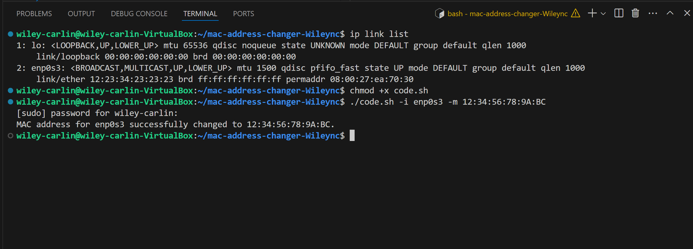

# MAC Address Changer

This shell script is a code that will change the MAC Address on Linux.
## Why?
We made this script to practice writing shell script to directly affect the machine and our terminal. The reason one would want to change their MAC Address could be for a plethora of reasons. Most commonly, you would change your MAC Address to appear as a different machine than your actually using. To mask your connection to the machine.
## What are some common commands we used?
### 1. Finding our Network Interface.
```
ip link list
```
This would list the ip link list of our machine, giving us this output...
```
wiley-carlin@wiley-carlin-VirtualBox:~/mac-address-changer-Wileync$ ip link list
1: lo: <LOOPBACK,UP,LOWER_UP> mtu 65536 qdisc noqueue state UNKNOWN mode DEFAULT group default qlen 1000
    link/loopback 00:00:00:00:00:00 brd 00:00:00:00:00:00
2: enp0s3: <BROADCAST,MULTICAST,UP,LOWER_UP> mtu 1500 qdisc pfifo_fast state UP mode DEFAULT group default qlen 1000
    link/ether 08:00:27:ea:70:30 brd ff:ff:ff:ff:ff:ff
```
From this we find that our Network is "enp0s3" which we will need later.
### 2. Making our file Exexutable.
```
chmod +x (file_name)
```
Or  in our case...
```
chmod +x code.sh
```
This takes our file and makes it executable. This allows us to run or execute our script later.
### 3. Running our script.
To run our script, we use the command...
```
./(filename) -i (Network Interface) -m (desired new MAC Address)
```
Or in our case...
```
./code.sh -i enp0s3 -m 12:34:56:78:9A:BC
```
### Possible Returns.
If "ip link set dev $INTERFACE up" is not true, your returned with...
```
Failed to bring up the interface $INTERFACE.
```
If "ip link set dev $INTERFACE address $NEW_MAC" is not true, your returned with...
```
Failed to change MAC address for $INTERFACE.
```
If "ip link set dev $INTERFACE down" is not true, your returned with...
```
Failed to bring down the interface $INTERFACE.
```
If "ip link show $INTERFACE > /dev/null 2>&1" is not true, your returned with...
```
Network interface $INTERFACE does not exist.
```
If "validate_mac $NEW_MAC" is not true, your returned with...
```
Invalid MAC address format. Use format: XX:XX:XX:XX:XX:XX
```